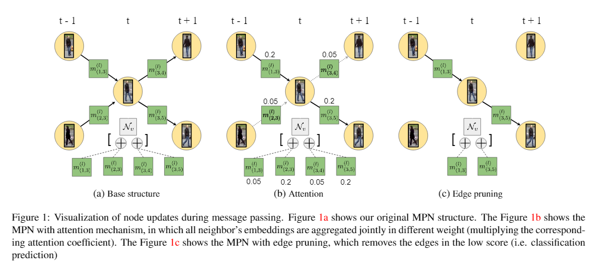

# Learning a Better Neural Network Architecture for Multiple Object Tracking

This implementation is based on the **CVPR 2020 (oral)** paper *Learning a Neural Solver for Multiple Object Tracking* ([Guillem Brasó](https://dvl.in.tum.de/team/braso/), [Laura Leal-Taixe](https://dvl.in.tum.de/team/lealtaixe/))
[[Paper]](https://arxiv.org/abs/1912.07515)[[Youtube]](https://www.youtube.com/watch?v=YWEirYMaLWc)[[CVPR Daily]](https://www.rsipvision.com/ComputerVisionNews-2020July/55/)

The old implementation addreess is [here](https://github.com/dvl-tum/mot_neural_solver).

Our 2 new mechanisms are showed below


## Setup

If you want to look the original setup, please read [old_README.md](https://github.com/anslt/ADL4CV/blob/master/old_README.md)

1. Clone and enter this repository:
   ```
   git clone --recursive https://github.com/anslt/ADL4CV.git
   cd mot_neural_solver
   ```
2. (**OPTIONAL**) Download Anaconda if you work on Colab
    ```
    wget -c https://repo.anaconda.com/archive/Anaconda3-2020.11-Linux-x86_64.sh
    chmod +x Anaconda3-2020.11-Linux-x86_64.sh
    bash ./Anaconda3-2020.11-Linux-x86_64.sh -b -f -p /usr/local
    rm Anaconda3-2020.11-Linux-x86_64.sh
    ```
3. Create an [Anaconda environment](https://docs.conda.io/projects/conda/en/latest/user-guide/tasks/manage-environments.html) for this project:
    ```
    conda env create -f environment.yaml
    conda activate mot_neural_solver
    pip install -e tracking_wo_bnw
    pip install -e .
    ```
4. Download the [MOTChallenge data](https://motchallenge.net/), reid network and preprocessed detection:
    ```
    bash scripts/setup/download_motcha.sh
    bash scripts/setup/download_models.sh
    bash scripts/setup/download_prepr_dets.sh
    ```
5. (**OPTIONAL**) Install other lacking package if you work on Colab:
    ```
    conda install -y ipykernel
    ```

## Training

For other parameters not including in [old_README.md](https://github.com/anslt/ADL4CV/blob/master/old_README.md) in training, we introduce below:

graph_model_params: <br />
&nbsp;&nbsp; time_aware: whether the node updating is time aware (defualt: False) <br />
&nbsp;&nbsp; attention: <br />
&nbsp;&nbsp;&nbsp;&nbsp;    use_attention: whether use attention (defualt: False) <br />
&nbsp;&nbsp;&nbsp;&nbsp;    alpha: LeakyRelu parameter (deafualt: 0.2) <br />
&nbsp;&nbsp;&nbsp;&nbsp;    attention_head_num: the number of attention network applied in MPN (deafualt: 2) <br />
&nbsp;&nbsp;&nbsp;&nbsp;    att_regu: apply regularization on MPN (deafualt: False) <br />
&nbsp;&nbsp;&nbsp;&nbsp;    att_regu_strength: weight of regularization (deafualt: 0.5) <br />
&nbsp;&nbsp;&nbsp;&nbsp;    new_softmax: apply regularization on MPN (deafualt: False)  <br />

&nbsp;&nbsp;  dynamical_graph: <br />
&nbsp;&nbsp;&nbsp;&nbsp;    graph_pruning: whether use graph (deafualt: False)  <br />
&nbsp;&nbsp;&nbsp;&nbsp;    first_prune_step: from which iteration we start prune the graph(deafualt: 4) <br />
&nbsp;&nbsp;&nbsp;&nbsp;    prune_factor: how many edges are pruned in each iteration(deafualt: 0.05) <br />
&nbsp;&nbsp;&nbsp;&nbsp;    prune_frequency: the frequency prune the graph(deafualt: 1) <br />
&nbsp;&nbsp;&nbsp;&nbsp;    mode: the score is generated in which method (deafualt: "classifier node wise") <br />
&nbsp;&nbsp;&nbsp;&nbsp;&nbsp;&nbsp;&nbsp;&nbsp;&nbsp;&nbsp;["classifier node wise","classifier naive","similarity node wise","similarity naive"] <br />
&nbsp;&nbsp;&nbsp;&nbsp;    prune_min_edge: the threshold of linked edges to stop pruning for a node (deafualt: 5) <br />


## Our Settiings
We use the cross_val_split 2.
We train a model with regularized attention by running:
```
python scripts/train.py with cross_val_split=2 train_params.save_every_epoch=True train_params.num_epochs=25 train_params.num_workers=4 graph_model_params.attention.use_attention=True graph_model_params.attention.att_regu=True graph_model_params.attention.new_softmax=True 
```

We train a model with edge pruning:
```
python scripts/train.py with cross_val_split=2 train_params.save_every_epoch=True train_params.num_epochs=25 train_params.num_workers=4 graph_model_params.dynamical_graph.graph_pruning=True
```

## Visualization
We use our attention + edge pruning to generate a small demo by clicking [here](https://drive.google.com/file/d/1EooBjkQwfYpPrTlxxEKm1x22wYoz5sDH/view?usp=sharing).


